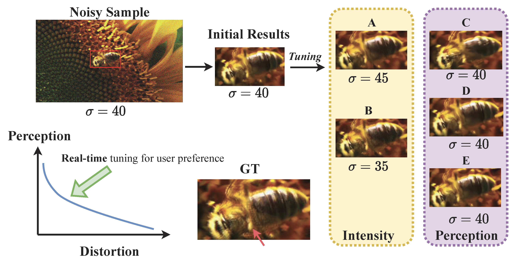
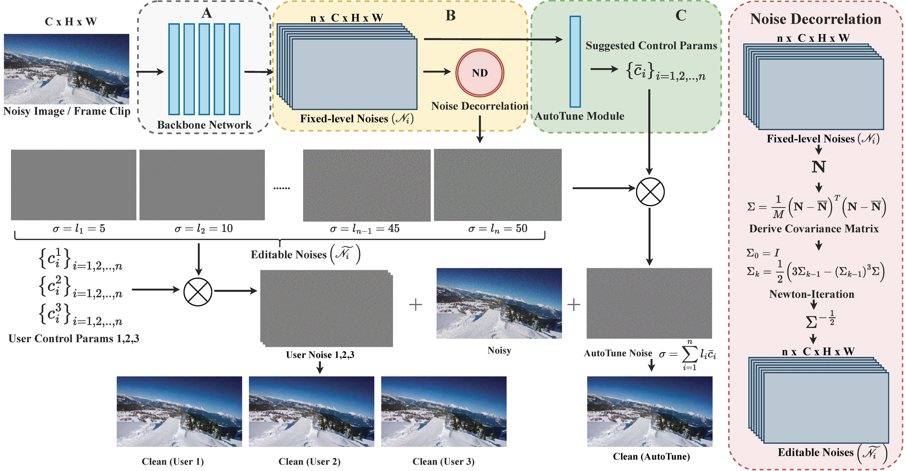
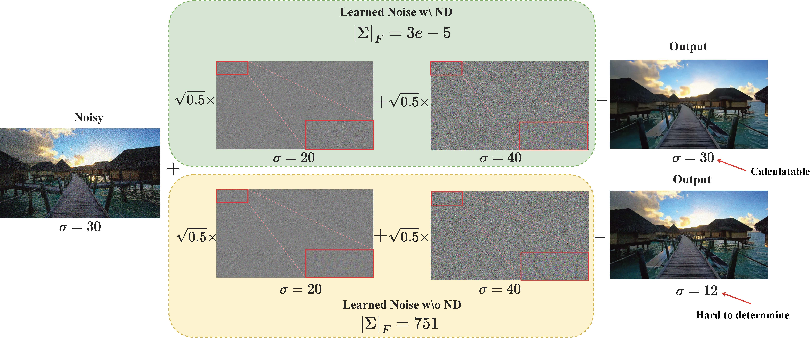
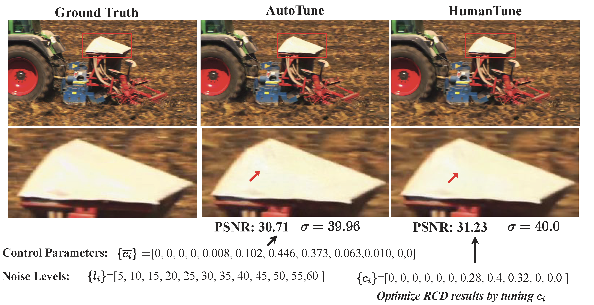
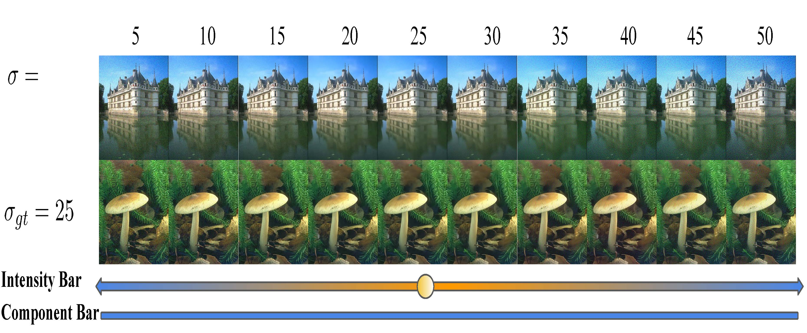
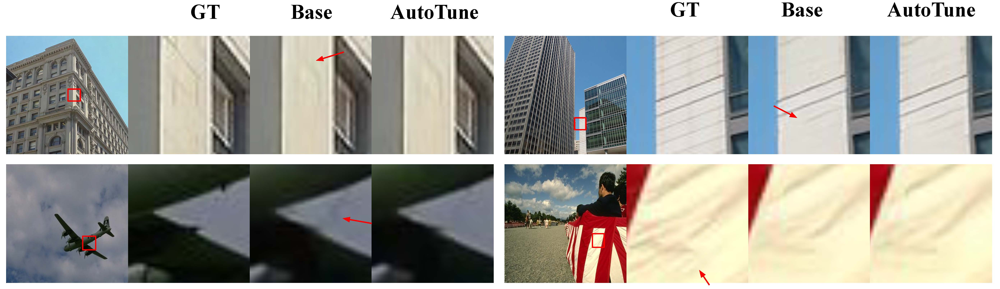

# Project page for paper "Real-time Controllable Denoising for Image and Video" published in CVPR 2023.

<video src="https://github.com/zzyfd/RCD-page/assets/13939478/0f75950f-bb72-45f0-9a80-f882de7a5c50" controls="controls" width="1000">
</video>

## Abstract

Controllable image denoising aims to generate clean samples with human perceptual priors and balance sharpness and smoothness. 
In traditional filter-based denoising methods, it can be easily achieved by adjusting filtering strength. For NN (Neural Network)-based models, we usually need to perform network inference each time we want to adjust the final denoising strength, which makes it almost impossible for real-time user interaction. 
In this paper, we present Real-time Controllable Denoising (RCD), the first deep image and video denoising pipeline which provides fully controllable user interface to edit arbitrary denoising level in real-time with only one-time network inference. 
Unlike existing controllable denoising methods, our RCD does not require multiple denoisers and training stages. It replaces the last output layer (usually outputs a single noise map) of an existing CNN-based model with a lightweight module, which outputs multiple noise maps. A novel Noise Decorrelation process is proposed to enforce the orthogonality of the noise feature maps. As a result, we can facilitate arbitrary noise level control by noise map interpolation. This process is network-free and doesn't require network inference. The experiments show that our RCD can enable real-time editable image and video denoising for various existing heavy-weight models without sacrificing their original performance.

| [Github](https://github.com/jiangyitong/RCD) | [Paper](https://openaccess.thecvf.com/content/CVPR2023/papers/Zhang_Real-Time_Controllable_Denoising_for_Image_and_Video_CVPR_2023_paper.pdf) | 
 

## Method Pipeline

## Editable Noises
| How noise decorrelation works for noise editting | How to control denoising results using RCD |
|  ----  | ----  |
|  | |
|With ND block, the covariance of learned noisesis reduced to almost zero, allowing us to derive determined interpolated results with target noise intensity. In contrast, without the Noise Decorrelation block the output noise level can not be guaranteed | Our AutoTune module can generate high-quality results using just the reference control parameters. Users can further improve the result by artificially tuning {ci} around {ci}, even at the same noiselevel.

## Visulizations

### Tuning Noise Intensity

### Image Denoising (AutoTune)

### Video Denoising (AutoTune)

